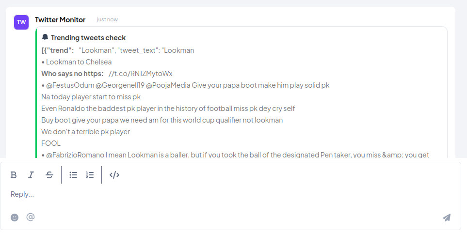
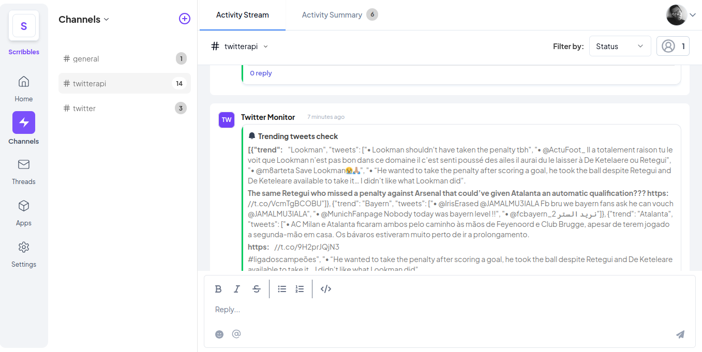

# Twitter NG Trends Monitor

Twitter NG Trends Monitor is a FastAPI application that retrieves the 5 latest tweets from the top 10 trending tweets on Twitter Nigeria.

## Project Structure

## Installation

1. Clone the repository:

   ```sh
   git clone <repository-url>
   cd <repository-directory>
   ```

2. Create a virtual environment and activate it:

   ```sh
   python -m venv venv
   source venv/bin/activate  # On Windows use `venv\Scripts\activate`
   ```

3. Install the dependencies:

   ```sh
   pip install -r requirements.txt
   ```

4. Create a [.env](http://_vscodecontentref_/7) file in the root directory with the following content:
   ```env
   TWITTER_USERNAME = 'your_twitter_username'
   TWITTER_EMAIL = 'your_twitter_email'
   TWITTER_PASSWORD = 'your_twitter_password'
   ```

## Usage

1. Run the FastAPI application:

   ```sh
   uvicorn main:app --reload
   ```

2. The application will be available at `http://127.0.0.1:8000`.

## API Endpoints

### Get Integration JSON

- **URL:** `/application.json`
- **Method:** `GET`
- **Response:**
  ```json
  {
      "data": {
          "date": {
              "created_at": "2025-02-20",
              "updated_at": "2025-02-20"
          },
          "descriptions": {
              "app_name": "Twitter NG Trends Monitor",
              "app_description": "Retrieves the 5 latest tweets from the top 10 trending tweets on Twitter Ng",
              "app_url": "http://127.0.0.1:8000"
          },
          "integration_category": "Monitoring & logging",
          "integration_type": "interval",
          "settings": [{"label": "interval", "type": "text", "required": True, "default": "0 * * * *"}],
          "tick_url": "http://127.0.0.1:8000/tick"
      }
  }
  ```

### Images

### Images




### Monitor Task

- **URL:** `/tick`
- **Method:** `POST`
- **Request Body:**
  ```json
  {
    "channel_id": "your_channel_id",
    "return_url": "your_return_url",
    "settings": [
      {
        "label": "interval",
        "type": "text",
        "required": true,
        "default": "0 * * * *"
      }
    ]
  }
  ```
- **Response:**
  ```json
  {
    "status": "accepted"
  }
  ```

## License

This project is licensed under the MIT License.
